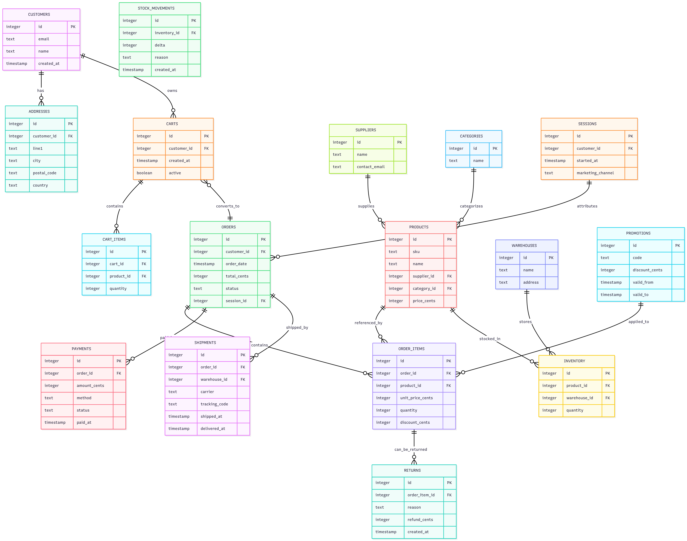

**Online Store Operations Database**

**Author:** Jibon Krishna

## Scope

**What is the purpose of your database?**  
This database models a medium-sized online store. It holds items, types, vendors, storage spots, stock shifts, buyers, baskets, purchases, money transfers, deliveries, refunds, deals, plus data on which ads lead to sales. Its aim is to show real-world actions so you can find answers about earnings per month, top goods sold, how many shoppers come back, patterns in returns, what marketing sources pay off, also the total worth of each buyer over time.

**Which people, places, things, etc. are included?**  
- Products, SKUs, categories, and suppliers.  
- Warehouses and inventory per warehouse.  
- Inventory audit trail as stock movements.  
- Customers, addresses, carts, and sessions (for attribution).  
- Orders, order items, payments, shipments, and returns.  
- Promotions and which order items used them.  
- Basic analytics views for revenue and reports.

**Which are outside the scope?**  
- No built-in system to handle payments. Instead, transactions get saved as data entries.
- No machine learning models or recommendation engine inside the DB.  
- No role based access control.

---

## Functional Requirements

**What should a user be able to do with the database?**  
- Create a product list, handle suppliers, also set up categories. Manage inventory details while organizing vendor info alongside grouping items logically.
- Monitor stock levels per warehouse while reviewing every item transfer.
- Set up clients, baskets, visits - turn baskets into purchases.
- Log payments along with order-linked deliveries.
Log returns tied to individual order entries while computing repayments.
- Apply discounts to order entries; track how they're used.
- Generate business summaries.

**What should a user not be able to do?**  
- Bypass business rules like creating duplicate SKUs or two active carts for the same customer.  
- Perform concurrent inventory deductions without application-level transaction handling.  
- Run administrative DB-level operations that are outside their role without separate admin access.  
- Expect in-database full text search.

---

## Representation

### Entities included
- `customers`: buyer accounts and basic profile.  
- `addresses`: shipping or billing addresses for customers.  
- `sessions`: session records for attribution and analytics.  
- `suppliers`: upstream product providers.  
- `categories`: product classification.  
- `products`: catalog items with SKU and price.  
- `warehouses`: storage locations.  
- `inventory`: quantity per product per warehouse.  
- `stock_movements`: audit logs for inventory changes.  
- `carts` and `cart_items`: transient shopping baskets.  
- `orders` and `order_items`: confirmed purchases.  
- `payments`: payment records, one per order.  
- `shipments`: shipment records per order.  
- `returns`: returns linked to order items.  
- `promotions` and `promotion_applied`: discount records and links.

### Attributes and types
- IDs are INTEGER primary keys for join efficiency.  
- Monetary values are stored as INTEGER cents to avoid floating point errors.  
- Timestamps use TIMESTAMP or TEXT in ISO format depending on engine.  
- Names, SKUs, emails, addresses are TEXT.  
- Status and method fields use TEXT constrained by CHECK to a small set of allowed values.  
- Quantities are INTEGER with CHECK to prevent negatives.

### Why these types
- INTEGER for IDs and counts because they are fast and index-friendly.  
- INTEGER cents for money avoids rounding errors and enforces exact arithmetic.  
- TEXT for human-readable fields and for portability across SQLite and Postgres.  
- CHECK constraints provide lightweight validation without heavy triggers.

### Key constraints and rules
- Primary keys on all id columns.  
- UNIQUE constraint on `products.sku`.  
- UNIQUE constraint to enforce at most one active cart per customer.  
- FOREIGN KEYs to enforce referential integrity and cascade deletes where appropriate for demo simplicity.  
- CHECK constraints for enumerations such as order status and payment status.  
- NOT NULL where business logic requires presence of a value.

---

## Relationships

- `customers 1 - n orders` : customers can place many orders.  
- `orders 1 - n order_items` : an order contains multiple order_items.  
- `products 1 - n order_items` : a product can appear across many order items.  
- `warehouses 1 - n inventory` and `products 1 - n inventory` : inventory is per product per warehouse.  
- `inventory 1 - n stock_movements` : each inventory record has movements for audit.  
- `orders 1 - 1 payments` : each order has at most one payment record in this model.  
- `orders 1 - n shipments` : an order may be fulfilled in multiple shipments.  
- `order_items 1 - n returns` : returns target specific order items.  
- `sessions 0..1 - n orders` : session optionally attributes multiple orders to a single marketing session.  
- `promotions n - m order_items` via `promotion_applied` : many-to-many linking of promotions to order items.

**ER Diagram**  

---

## Optimizations

**Indexes**
Indexes to support the most common query patterns and the views:

- `orders(order_date)` — speeds up monthly and time range reports.  
- `orders(customer_id)` — speeds up customer lookups and lifetime value queries.  
- `order_items(product_id)` and `order_items(order_id)` — speed product revenue aggregation and order expansion.  
- `inventory(product_id, warehouse_id)` — fast stock checks and joins with stock movements.  
- `products(category_id)` — speeds category-level product reports.  
- `payments(paid_at)` — speeds cashflow and payment time series queries.  
- `sessions(customer_id)` — speeds session attribution joins.

### Views and why they help
- `monthly_revenue` - This view aggregates revenue month by month. It makes monthly reporting and trend checks fast without rewriting long queries.
- `product_revenue` - This view summarizes how each product performs. It is useful for ranking best-selling items and analyzing category performance.
- `returns_summary` - This view shows how often each product is returned and how much money was refunded. It helps spot problematic items with high return rates.
- `customers_order_summary` - This view gives per-customer metrics: total orders, total spending, average order size, and first/last order dates. It simplifies lifetime value calculations and repeat customer analysis.

---

## Limitations

**What this design does not handle well**  
1. Concurrency on inventory. The schema does not solve race conditions. Application side locking or DB-level transactional patterns are required for safety.
2. Product variants and complex catalogs. The model assumes single SKU items. Variant modeling would need product variant tables.
3. Access control. No role based access control is implemented at the DB level.  
4. Massive scale optimizations. This design is fine for demo and small production but needs partitioning, indexing, and tuning for very large datasets.